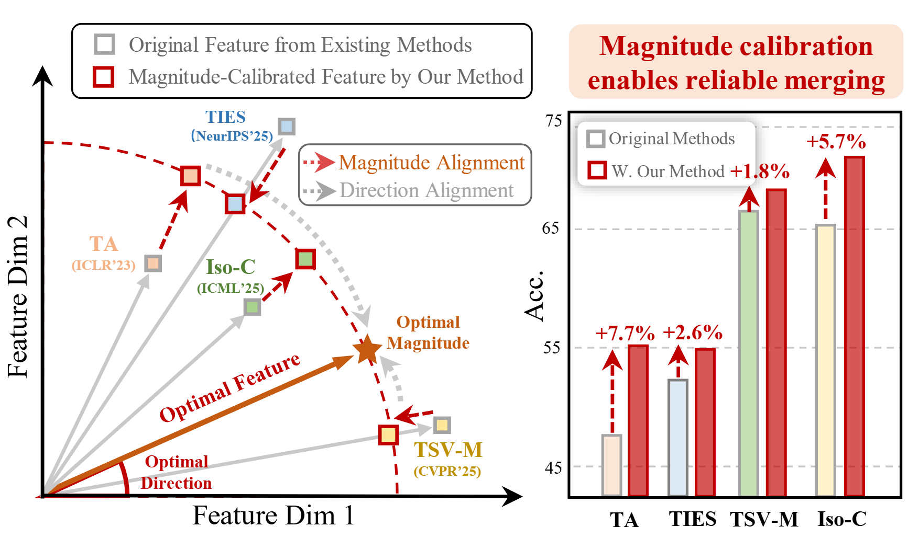

# MAGIC: Achieving Superior Model Merging via Magnitude Calibration

<p align="center">
  
</p>

<p align="center">
  <a href="https://arxiv.org/abs/2512.19320"><b>[Paper]</b></a>
  ·
  <a href="#quick-start"><b>Quick Start</b></a>
  ·
  <a href="#reproducibility"><b>Reproducibility</b></a>
  ·
  <a href="#acknowledgements"><b>Acknowledgements</b></a>
</p>

---

## News

- **2025-12-22**: Our paper was submitted to arXiv.
- **2025-12-25**: Our paper was featured by the **我爱计算机视觉** WeChat official account. We sincerely thank them for the coverage:
  <a href="https://mp.weixin.qq.com/s/HnEY8NQdR7_lRG8MndV-Rg"></a>

---

## TL;DR

**MAGIC** is a *training-free, plug-and-play* post-merging calibration framework that improves merged models by **calibrating layer-wise magnitudes** (in **feature space**, **weight space**, or **both**).

- **Why**: existing merging methods mainly align *feature directions* but often distort *feature magnitudes*, which hurts performance.
- **How**: estimate a **layer-wise calibration coefficient** $ξ_l$ and rescale magnitudes with three variants:
  - **FSC** (Feature Space Calibration): uses a small set of **unlabeled** data.
  - **WSC** (Weight Space Calibration): **data-free** calibration in weight space.
  - **DSC** (Dual Space Calibration): combines WSC + FSC.

---

## Overview

Current merging methods approximate specialised models (the “optimal reference”). While features consist of both **direction** and **magnitude**, most approaches overlook magnitude alignment. 
**MAGIC** improves merged model reliability by **reducing magnitude deviation** and calibrating **layer-wise** (rather than global scaling).

---

## Contents

- [MAGIC: Achieving Superior Model Merging via Magnitude Calibration](#magic-achieving-superior-model-merging-via-magnitude-calibration)
  - [News](#news)
  - [TL;DR](#tldr)
  - [Overview](#overview)
  - [Contents](#contents)
  - [Quick Start](#quick-start)
    - [0) Set up environment](#0-set-up-environment)
    - [1) Prepare data \& checkpoints](#1-prepare-data--checkpoints)
    - [2) Detect magnitude-sensitive layers](#2-detect-magnitude-sensitive-layers)
    - [3) Merge + calibrate (example: ViT-B/32)](#3-merge--calibrate-example-vit-b32)
  - [Installation](#installation)
  - [Data Preparation](#data-preparation)
  - [Checkpoints](#checkpoints)
  - [Usage](#usage)
    - [1) Magnitude-Sensitive Layer Detection](#1-magnitude-sensitive-layer-detection)
    - [2) Vision (CLIP / ViT)](#2-vision-clip--vit)
      - [Task Arithmetic](#task-arithmetic)
      - [TA + WSC / FSC / DSC](#ta--wsc--fsc--dsc)
      - [Iso-CTS + DSC (example)](#iso-cts--dsc-example)
    - [3) NLP (BERT)](#3-nlp-bert)
  - [Reproducibility](#reproducibility)
  - [FAQ](#faq)
  - [Acknowledgements](#acknowledgements)

---

## Quick Start

### 0) Set up environment
```bash
conda env create
conda activate task-vectors
```

### 1) Prepare data & checkpoints

- Put datasets under `./data/`
- Put checkpoints under `./checkpoints/`

### 2) Detect magnitude-sensitive layers

```
python main_sensitive_layers_detection.py
```

### 3) Merge + calibrate (example: ViT-B/32)

```
# Task Arithmetic (no calibration)
python main_CLIP.py --merge TA --space N

# + Weight Space Calibration (WSC)
python main_CLIP.py --merge TA --space W

# + Feature Space Calibration (FSC)
python main_CLIP.py --merge TA --space F

# + Dual Space Calibration (DSC)
python main_CLIP.py --merge TA --space D
```
## Installation

```
conda env create
conda activate task-vectors
```


## Data Preparation

We follow the dataset processing pipelines from:

- **task_vectors**: https://github.com/mlfoundations/task_vectors
- **AdaMerging**: https://github.com/EnnengYang/AdaMerging/tree/main

📁 **Put datasets here**:

```
./data/
```


## Checkpoints

You can download fine-tuned **vision** checkpoints from: [Github](https://github.com/mlfoundations/task_vectors#checkpoints) or [Google Drive](https://drive.google.com/drive/folders/1u_Tva6x0p6oxu5Eo0ZZsf-520Cc_3MKw).

And our fine-tuned **BERT** checkpoints from: [Google Drive](https://drive.google.com/drive/folders/1hJ1Yawr2NLQxCHp4Nam6AVlzDTvpzjUE?usp=sharing).

📁 **Put checkpoints here**:

```
./checkpoints/
```

**Note**
 If `torch.load(xxx_checkpoint).state_dict()` fails, try:

```
pickle.load(open(xxx_checkpoint, 'rb')).state_dict()
```

------

## Usage

### 1) Magnitude-Sensitive Layer Detection

MAGIC uses *magnitude-sensitive layers* to avoid harmful “scale-up” on overly sensitive layers.

```
python main_sensitive_layers_detection.py
```
The set of magnitude-sensitive layers will be saved in ```./components/```. When magnitude-sensitive layers are not used, set the variable weak_comps in the code to None.


### 2) Vision (CLIP / ViT)

**Supported merge methods** depend on the codebase (e.g., `TA`, `TIES`, `Iso-C`, `Iso-CTS`, ...).
 Calibration “space” options:

- `N`: No calibration
- `W`: WSC
- `F`: FSC
- `D`: DSC

#### Task Arithmetic

```
python main_CLIP.py --merge TA --space N
```

#### TA + WSC / FSC / DSC

```
python main_CLIP.py --merge TA --space W
python main_CLIP.py --merge TA --space F
python main_CLIP.py --merge TA --space D
```

#### Iso-CTS + DSC (example)

```
python main_CLIP.py --merge Iso-CTS --space D
```


### 3) NLP (BERT)

Example (DSC):

```
python main_BERT.py --merge Iso-CTS --space D
```


## Reproducibility

A recommended pipeline to reproduce paper-style results:

1. **Download datasets** and put them under `./data/`
2. **Download checkpoints** and put them under `./checkpoints/`
3. Run **magnitude-sensitive layer detection**
4. Run merging baselines (`--space N`)
5. Run MAGIC variants (`--space W/F/D`) and compare


## FAQ

**Q: FSC needs data — how much do I need?**
 A: FSC is designed to work with *a very small amount* of unlabeled data (often minimal per task).

**Q: My checkpoint can’t be loaded with `torch.load(...).state_dict()`**
 A: Use `pickle.load(...).state_dict()` (see note in [Checkpoints](#checkpoints)).


## Acknowledgements

Our implementation references the following repositories (thank you!):

- AdaMerging: https://github.com/EnnengYang/AdaMerging/tree/main
- Task Arithmetic (task_vectors): https://github.com/mlfoundations/task_vectors
- TIES-MERGING: https://github.com/prateeky2806/ties-merging/tree/main
- Model Soups: https://github.com/mlfoundations/model-soups
- Tent: https://github.com/DequanWang/tent
- TSV-M: https://github.com/AntoAndGar/task_singular_vectors
- Iso-CTS: https://github.com/danielm1405/iso-merging


## 📒 Citation

If you find our work useful for your research, please consider citing the paper:

```bash
@article{li2025magic,
  title={MAGIC: Achieving Superior Model Merging via Magnitude Calibration},
  author={Li, Yayuan and Zhang, Jian and Guo, Jintao and Cheng, Zihan and Qi, Lei and Shi, Yinghuan and Gao, Yang},
  journal={arXiv preprint arXiv:2512.19320},
  year={2025}
}
```
